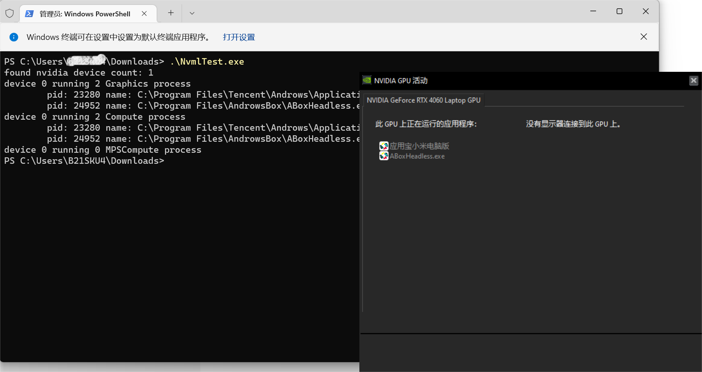

使用[NVML API](https://docs.nvidia.com/deploy/nvml-api/index.html)获取Nvidia GPU上正在运行的进程。

- 需要调用`nvmlDeviceGetGraphicsRunningProcesses`、`nvmlDeviceGetComputeRunningProcesses`、`nvmlDeviceGetMPSComputeRunningProcesses`三个函数获取三种计算类型的进程，进程列表可能有重复

- 如果需要监视进程的变化，需要循环调用上述三个函数。

NVML API包含在[GPU Deployment Kit](https://developer.nvidia.com/tesla-deployment-kit)中，而[GPU Deployment Kit](https://developer.nvidia.com/tesla-deployment-kit)包含在 [CUDA Toolkit](https://developer.nvidia.com/cuda-downloads)中。

截图

